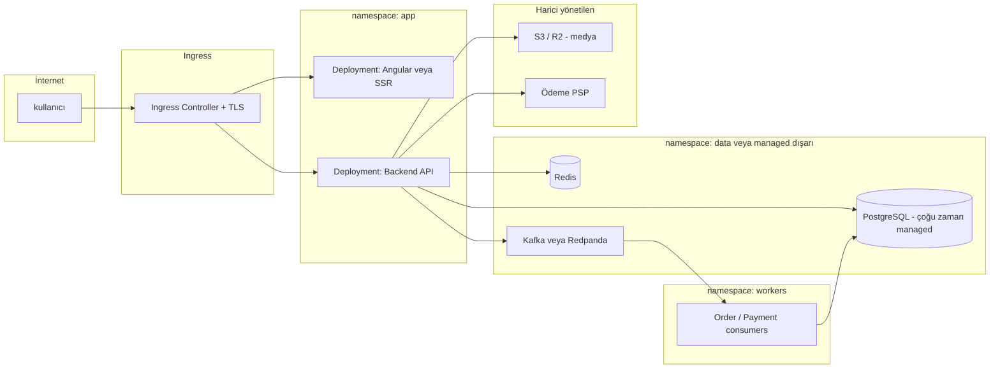
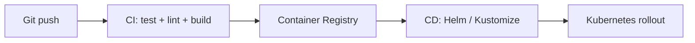

# DevOps ve Kubernetes Mimarisi — E-Ticaret

Bu doküman, çanta e-ticaret projesi için **CI/CD**, **konteynerleştirme**, **Kubernetes topolojisi** ve **gözlemlenebilirlik** önerilerini içerir. VPS’den K8s’e geçiş mantığıyla uyumludur.

---

## 1. Felsefe: ne zaman Kubernetes?

| Durum | Öneri |
|-------|--------|
| Tek VPS, düşük-orta trafik, tek kişi operasyon | **Docker Compose** + reverse proxy (Traefik / Caddy / NGINX) |
| Çoklu ortam, sık deploy, sıfır kesinti hedefi, birden fazla servis | **Kubernetes** (managed cluster: tercihen) |
| “Öğrenmek ve ileride ölçeklemek istiyorum” | Dev/staging’de K8s; prod’da başlangıçta küçük cluster veya Compose |

**Kubernetes faydası:** yatay ölçek, rolling update, secret/config ayrımı, ingress ile TLS merkezi yönetim.  
**Maliyeti:** cluster bakımı, YAML karmaşıklığı, networking öğrenme eğrisi.

---

## 2. Hedef mimari (K8s üzerinde)

**Not:** PostgreSQL’i cluster içinde StatefulSet ile çalıştırmak mümkündür; üretimde çoğu ekip **managed DB** (RDS, DO Managed, Aiven vb.) kullanır: yedekleme ve failover daha az riskli.

---

## 3. Namespace ve kaynak organizasyonu

| Namespace | İçerik |
|-----------|--------|
| `ingress-nginx` veya `traefik` | Ingress controller |
| `cert-manager` | Let’s Encrypt otomasyonu |
| `app` | `api`, `web` (Angular SSR veya static + nginx) |
| `workers` | Kafka **consumer** deployment’ları (bildirim, stok, projeksiyon) |
| `kafka` veya `redpanda` | Broker: **Strimzi** (Kafka), **Redpanda** Helm chart, veya **Confluent** dış managed |
| `observability` (opsiyonel) | Prometheus, Grafana, Loki — veya SaaS (Datadog, Grafana Cloud) |

**Etiketleme:** `app.kubernetes.io/name`, `version`, `env=prod|staging`.

---

## 4. Deployment kalıpları

### 4.1 API (Backend)

- **Deployment** + **HorizontalPodAutoscaler** (CPU veya özel metrik; ödeme sezonunda replica artışı).
- **PodDisruptionBudget:** node drain sırasında minimum erişilebilir pod.
- **Liveness / Readiness:** DB ve Redis hazır olmadan trafik almayın.
- **Resource requests/limits:** JVM/.NET GC veya Node heap için limitleri test ile belirleyin.

### 4.2 Frontend

- **Seçenek 1 — Static build:** Angular `ng build` çıktısı **nginx** imajı; Ingress’ten `path: /` → nginx.
- **Seçenek 2 — SSR:** ayrı Node/.NET container; cache (Redis) veya CDN ile HTML cache.

### 4.3 Arka plan işleri ve Kafka

- **Domain olayları** (`order.created`, `payment.succeeded` vb.) Kafka topic’lerine yazılır; **ayrı Deployment** olarak çalışan consumer’lar e-posta, stok, raporlama gibi yan etkileri işler.
- **Broker seçenekleri:** küçük cluster için **Redpanda** (Kafka API uyumlu, tek binary); klasik **Kafka** için **Strimzi** operatörü; operasyon istemezseniz **managed Kafka** (Aiven, Confluent, MSK).
- **Zookeeper / KRaft:** yeni Kafka sürümleri KRaft ile ZK’sız; chart/operatör dokümantasyonuna göre ilerleyin.
- **Persistence:** Kafka için `PersistentVolumeClaim` + uygun `storageClass`; retention ve disk boyutu topic hacmine göre planlanır.
- Alternatif (daha az bileşen): **Redis Streams** veya **RabbitMQ** — aynı consumer deseni, farklı broker.

### 4.4 Cron ve batch

- Görsel işleme veya günlük rapor: **CronJob** veya Kafka **scheduled** tüketim yerine basit zamanlayıcı.

---

## 5. Konfigürasyon ve sırlar

- **Secret:** API anahtarları, DB şifresi, PSP webhook secret — `SealedSecrets`, **External Secrets Operator** (Vault, AWS Secrets Manager, Cloudflare) veya CI’dan sadece referans.
- **ConfigMap:** özellik bayrakları, log seviyesi, public URL’ler (gizli olmayan).

**Asla:** imaj içine gömülü production secret.

---

## 6. Ağ ve TLS

- **Ingress:** NGINX Ingress veya Traefik.
- **cert-manager** + ACME (Let’s Encrypt).
- **WAF / DDoS:** Cloudflare proxy önünde kullanımı yaygın (origin’de gerçek IP için header ayarı).

---

## 7. Depolama (K8s içi)

- **Uygulama stateless:** pod diski kalıcı olmasın.
- **Medya (önerilen):** S3/R2; PVC kullanmayın (yedek ve çoğaltma S3’te).
- **Medya (alternatif / self-host): MinIO**
  - MinIO da S3 uyumlu olduğu için uygulama kodu değişmeden “endpoint” değiştirerek çalıştırılabilir.
  - **K8s’te çalıştıracaksanız**: persistence için PVC + uygun storageClass, TLS termination, ve mutlaka yedekleme planı gerekir.
  - Tek node MinIO mümkün ama risklidir; iş kritikliğine göre replication/erasure mode ve izleme düşünün.
- **DB managed değilse:** StatefulSet + **dikkatli** yedekleme stratejisi (Velero, periyodik dump).

---

## 8. CI/CD pipeline (önerilen akış)

| Aşama | Araç örnekleri |
|-------|----------------|
| Kaynak | GitHub / GitLab |
| CI | GitHub Actions, GitLab CI |
| İmaj | `ghcr.io`, GitLab Registry, ECR |
| CD | Argo CD, Flux CD veya `kubectl` + Helm (MVP) |
| Versiyonlama | Git tag → imaj `:sha` veya `:semver` |

**Politika:** `main` → staging; `tag` veya onaylı pipeline → production.

---

## 9. Gözlemlenebilirlik

| Alan | Minimum | İleri seviye |
|------|---------|--------------|
| Log | stdout aggregation (Loki / CloudWatch / Elastic Agent) | trace id ile korelasyon |
| Metrik | Prometheus + Grafana | RED/USE metrikleri, API latency |
| İz | OpenTelemetry → Jaeger / Tempo | ödeme ve kargo span’leri |
| Uyarı | Pod restart, 5xx artışı, ödeme webhook hata oranı | SLO tabanlı uyarı |

---

## 10. Yedekleme ve felaket

- **DB:** günlük tam + sürekli WAL (PostgreSQL); restore testi ayda bir.
- **Bucket:** versioning + lifecycle (eski raw görsel arşivi ucuz sınıfa taşıma).
- **K8s:** kritik YAML ve Helm chart’ları Git’te (GitOps).

---

## 11. Güvenlik checklist

- [ ] NetworkPolicy: API’ye sadece Ingress’ten gelen trafik (mümkünse)
- [ ] RBAC: CI servis hesabı minimal yetki
- [ ] İmaj tarama: Trivy / Grype pipeline’da
- [ ] Pod Security Standards (restricted profile hedefi)
- [ ] Güvenli başlıklar (Helmet benzeri middleware), HSTS

---

## 12. Helm / Kustomize

- **Helm chart:** `api`, `web`, `worker` alt chart’ları veya tek chart içinde alt template.
- **Kustomize:** ortam başına overlay (`base` + `overlays/staging`, `overlays/prod`).

MVP için tek chart yeterli; büyüdükçe chart’ları ayırın.

---

## 13. Maliyet ve basitlik notu

Küçük işletme e-ticareti için **managed Kubernetes** (GKE Autopilot, EKS Fargate parçaları, DigitalOcean Kubernetes) tek node pool + küçük node ile başlanabilir. DB ve Redis’i mümkünse managed tutmak operasyon yükünü ciddi azaltır.

---

## 14. Bu repo ile ilişki

Uygulama mimarisi ve ürün yol haritası: **ETICARET-MIMARI-YOL-HARITASI.md**.  
İki doküman birlikte “mantıksal mimari + altyapı/K8s” çiftini oluşturur.
