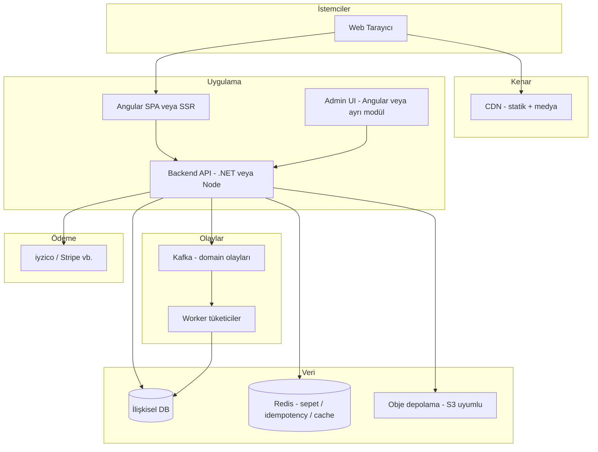

# Çanta E-Ticaret Sitesi — Mimari ve Yol Haritası

Bu doküman, WordPress tabanlı yavaş bir mağazayı modern bir stack ile yenilemek için **uygulama mimarisi**, **teknoloji seçimleri** ve **aşamalı yol haritasını** özetler. Hedef: ölçeklenebilir, yönetilebilir ve performanslı bir e-ticaret.

---

## 1. Yol haritası (özet)

| Faz | Süre (tahmini) | Çıktı |
|-----|------------------|--------|
| **F0 — Keşif** | 1–2 hafta | Mevcut site: ürün sayısı, ödeme/kargo entegrasyonları, SEO URL’leri, içerik envanteri |
| **F1 — Tasarım & domain model** | 1–2 hafta | Ürün, varyant, stok, sipariş, kullanıcı, kampanya entity’leri; API sözleşmesi (OpenAPI) |
| **F2 — MVP backend + admin** | 4–8 hafta | Katalog, sepet (veya checkout öncesi akış), sipariş, ödeme webhook’ları, basit admin paneli |
| **F3 — Mağaza frontend (Angular)** | 4–8 hafta | Ürün listesi/detay, arama/filtre, sepet, ödeme sayfası, hesabım |
| **F4 — İçerik & SEO** | sürekli | SSR veya prerender, meta/structured data, 301 yönlendirmeleri (eski WordPress URL → yeni) |
| **F5 — Gözlem & sertleştirme** | 2–4 hafta | Log/metric, rate limit, yedekleme, güvenlik taraması |
| **F6 — Ölçek** | ihtiyaca göre | CDN, read replica, arama motoru, K8s (bkz. DevOps dokümanı) |

**Pratik öneri:** İlk sürümde tek VPS + Docker Compose ile canlıya alın; trafik ve operasyon ihtiyacı netleşince Kubernetes’e geçin.

---

## 2. Mimari ilkeler

- **Domain odaklı API:** Sipariş, ödeme, stok kuralları tek bir “God service” içinde şişmesin; bounded context’lere bölünebilir ama MVP’de modüler monolit yeterli.
- **Durumsuz API + JWT veya cookie session:** Ölçek için uygun.
- **Olay güdümlü akış (Kafka):** Sepet satırı eklendi/çıkarıldı, sipariş oluşturuldu, ödeme başarılı gibi **iş kuralları ve yan etkiler** mesajlar üzerinden izlenebilir; denetim günlüğü, tekrar oynatma ve tüketici ekleme kolaylaşır. Bkz. [§6 Olaylar ve mesajlaşma](#6-olaylar-ve-mesajlaşma-kafka--redis).
- **Tek kaynak gerçeği:** “Güvenlik hissi” mesajdan gelir ama **nihai tutarlılık** yine veritabanında (transaction + idempotency) korunmalıdır; kuyruk yedek değil, **orchestration / audit / async yan etki** katmanıdır.
- **Okuma/yazma ayrımı (ileride):** Yoğun katalog okuması için cache veya ayrı read model düşünülebilir.

---

## 3. Yüksek seviye diyagram

---

## 4. Backend seçimi: .NET mi Node mu?

| Kriter | .NET (ASP.NET Core) | Node.js (NestJS / Fastify) |
|--------|---------------------|----------------------------|
| Tip güvenliği, büyük domain | Güçlü | TS ile güçlü |
| E-ticaret ekosistemi | Kurumsal projelerde çok | NPM paket çeşitliliği |
| Hosting / performans | Mükemmel | İyi (doğru framework ile) |

**Sizin seçim:** Angular + **ASP.NET Core**; backend’de **Repository deseni** (gerektiğinde **Unit of Work**) ile kalıcılığı soyutlayın, iş kuralları Application/Domain katmanında kalsın.

- **MVP:** Modüler monolit (tek deploy edilen API).
- **Büyüme:** Ödeme, bildirim, raporlama gibi sınırları net modüller; gerektiğinde ayrı servislere çıkarılır.

### 4.1 .NET katmanları (Repository)

| Katman | Rol |
|--------|-----|
| **API** | HTTP, doğrulama, DTO; ince kalır. |
| **Application** | `AddToCart`, `CreateOrder`, `RecordPaymentSuccess` — transaction ve outbox tetikleme burada netleşir. |
| **Domain** | Entity, domain olayları, iş kuralları. |
| **Infrastructure** | `EfOrderRepository`, Kafka producer, Redis implementasyonları. |

Repository yalnızca **veri erişimi** içindir; “güvenli sipariş akışı” mesaj + transaction + idempotency kombinasyonu ile kurulur.

---

## 5. Veritabanı: ne seçilmeli? “Elastic” ne demek?

### 5.1 Birincil işlem verisi (sipariş, stok, kullanıcı)

**Öneri: PostgreSQL**

- ACID, ilişkisel model, JSONB ile esnek alanlar.
- Row-level locking ile stok/satır çakışmalarında güvenilir davranış.
- Managed seçenekler: AWS RDS, Azure Database, DigitalOcean Managed DB, Hetzner + self-host (operasyon sizde).

**MySQL / MariaDB** de e-ticarette yaygın; ikisi de olur. Yeşil alan için PostgreSQL hafif üstün.

### 5.2 “Elastic” = Elasticsearch mi? — Sizin ölçek için net cevap

**~20 çeşit çanta** ve yoğun arama beklentisi yoksa: **Elasticsearch / OpenSearch eklemeyin.**

- Liste ve detay sayfaları doğrudan **PostgreSQL** (veya cache’lenmiş API yanıtı) ile beslenir; filtre “kategori / renk / fiyat aralığı” gibi birkaç kolon + indeks ile rahat çözülür.
- İleride ürün sayısı yüzlerce/binlere çıkar ve tam metin + facet karmaşıklaşırsa o zaman Meilisearch / OpenSearch değerlendirilir.

### 5.3 Redis

- **Sepet (özellikle misafir):** hızlı okuma/yazma, TTL, yapılandırılmış hash/liste.
- **Idempotency anahtarları:** ödeme webhook’u veya “sipariş oluştur” isteğinin tekrarında çift işlem engeli.
- **Rate limit, kısa ömürlü tokenlar, sık okunan katalog özeti** (20 ürün için bile cache basitleştirir).

---

## 6. Olaylar ve mesajlaşma (Kafka + Redis)

### 6.1 Neden mesaj?

Sepete ekleme, sepetten çıkarma, sipariş oluşturuldu, ödeme başarılı gibi adımları **domain olayı** olarak Kafka’ya yazmak:

- Tüm kritik geçişler **append-only bir log**’da izlenir (denetim, hata ayıklama, “ne oldu?” sorusu).
- E-posta, stok düşümü, analitik, entegrasyonlar **async tüketici** ile API’den ayrışır.
- Trafik artınca tüketiciyi bağımsız ölçeklersiniz.

**Güvenlik / doğruluk notu:** Mesaj “daha güvenli” hissettirse de asıl güvence **DB transaction**, **idempotency** (Redis veya DB unique constraint) ve **Outbox deseni**dir: önce işlem kalıcı yazılır, sonra outbox’tan Kafka’ya güvenilir şekilde yayınlanır (çift gönderim ve broker kesintisi senaryoları).

### 6.2 Kafka: sizin proje için mantıklı mı?

| Artı | Eksi (küçük işletme ölçeği) |
|------|----------------------------|
| Olay şeması, replay, çok tüketici | Operasyon: broker, topic, retention, izleme |
| Ödeme/stok gibi kritik zinciri gevşetir | Tek VPS’te RAM/CPU maliyeti |

**Özet:** Mimariyi öğrenmek ve olayları birinci sınıf yapmak istiyorsanız **Kafka kullanılabilir**; operasyonu hafifletmek için **Redpanda** (Kafka uyumlu, daha az JVM ekosistemi) veya **managed Kafka** (Confluent Cloud, AWS MSK, Aiven) değerlendirilebilir. Alternatif olarak aynı desen **RabbitMQ** veya **Redis Streams** ile de kurulur; Kafka “standart enterprise log” rolünü daha iyi doldurur.

### 6.3 Örnek olaylar (topic / mesaj türleri)

Örnek isimlendirme (konvansiyon sizin): `cart.line-added`, `cart.line-removed`, `order.created`, `payment.succeeded` (veya tek topic `commerce.events` + `eventType` alanı).

- **Üretici:** Application katmanı işlem + outbox commit sonrası (veya transaction içi outbox tablosu + ayrı dispatcher).
- **Tüketici:** `NotificationWorker`, `InventoryWorker`, `AnalyticsProjection` gibi ayrı deploy edilebilir süreçler (modüler monolit içinde ayrı hosted service de olabilir; büyüyünce ayrı pod).

### 6.4 Redis ile Kafka birlikte

- **Redis:** sepet state, idempotency, cache, kısa kilitler.
- **Kafka:** kalıcı/izlenebilir **iş olayı** akışı ve yan etkiler.

İkisi çakışmaz; farklı sorulara cevap verir.

---

## 7. Fotoğraflar ve dosyalar nerede tutulmalı?

### 7.1 Uygulama sunucusu diski (VPS tek başına)

- **Artı:** Basit.
- **Eksi:** Yatay ölçekte dosya tutarsızlığı; yedekleme ve CDN bağlama zor.

### 7.2 Obje depolama (önerilen üretim modeli)

- **S3 uyumlu depo:** AWS S3, Cloudflare R2, Backblaze B2, Wasabi, MinIO (kendi sunucunuzda).
- **Akış:** API yüklemeyi kabul eder → **presigned URL** ile doğrudan bucket’a PUT → veritabanında sadece **public URL veya CDN URL** saklanır.
- **CDN:** Cloudflare (R2 ile iyi uyum), veya S3 + CloudFront.

### 7.2.1 MinIO kullanırsak nasıl olur?

MinIO, S3 uyumlu bir obje depolamadır. **“Kendi VPS’im var, maliyeti ve veriyi kontrol etmek istiyorum”** senaryosunda iyi çalışır ve S3 API sayesinde ileride R2/S3 gibi servislere taşınmayı kolaylaştırır.

**Önerilen model (prod’a en yakın):**

- Bucket private olur; frontend upload için **presigned PUT** alır.
- API DB’de **`objectKey` + metadata** tutar (URL’yi doğrudan saklamak yerine anahtarı saklamak genelde daha esnektir).
- İndirme için ya CDN/proxy ile public servis edilir ya da **presigned GET** üretilir (ihtiyaca göre).

**Operasyon checklist (minimum):**

- **Yedekleme:** günlük snapshot + farklı lokasyona kopya (en az farklı disk/VM).
- **Disk/kapasite:** doluluk alarmı, lifecycle; mümkünse RAID.
- **TLS:** MinIO endpoint HTTPS arkasında.
- **Erişim:** access key/secret yalnız secret store’da; bucket policy ile kısıt.
- **Tek node riski:** tek instance MinIO’da disk arızası kritik; iş kritikse replication/erasure + izleme düşünün.

### 7.3 “AWS şart mı?”

- **Hayır.** AWS güçlü ama maliyet/karmaşık faturalama ve servis çeşitliliği yükü olabilir.
- **Pratik:** Avrupa odaklı, basit fatura: **Hetzner VPS + Cloudflare R2 + Cloudflare CDN** gibi kombinasyonlar sık kullanılır.
- **Türkiye / KVKK:** iyzico gibi ödeme sağlayıcıları ile çalışırken kişisel veri işleme akışını (sipariş bilgileri, iletişim bilgileri, ödeme sonucu) netleştirin. Bu **otomatik olarak “yasak” veya “sıkıntı”** anlamına gelmez; pratikte çoğu işletme **aydınlatma metni**, gerekirse **açık rıza** senaryoları ve tedarikçi sözleşmeleri ile süreci tamamlar. Teknik tarafta hangi verinin nerede tutulacağı bilinçli tasarlanmalıdır.

### 7.4 Görsel işleme

- Orijinal + **webp/avif** türevleri; thumbnail boyutları (liste / detay / zoom).
- İşleme: arka planda worker (kuyruk: Hangfire, BullMQ) veya yükleme anında hafif pipeline.

---

## 8. Frontend: Angular + atomik tasarım

### 8.1 SSR / SPA

| Yaklaşım | Artı | Eksi |
|----------|------|------|
| **SPA (CSR)** | Basit deploy | SEO için ekstra özen (prerender, meta) |
| **Angular SSR (Universal)** | Ürün sayfalarında SEO | Sunucu ve cache stratejisi gerekir |

**Öneri:** Ürün ve kategori sayfaları SEO kritikse **SSR veya en azından önemli route’lar için prerender** planlayın. Admin paneli tamamen CSR kalabilir.

### 8.2 Atomik mimari (Atoms → Molecules → Organisms)

Brad Frost’un atomik modelini Angular bileşenlerine eşlersiniz; klasör yapısı örnek: `ui/atoms/`, `ui/molecules/`, `ui/organisms/`, `features/` (sayfa akışları).

| Seviye | Örnek (çanta mağazası) |
|--------|------------------------|
| **Atom** | Tek görsel (`ProductImage`), fiyat metni, rozet, ikon, “duyuru şeridi” satırı. |
| **Molecule** | Görsel + kısa açıklama; fiyat + para birimi; renk seçici satırı. |
| **Organism** | Ürün kartı (liste), ürün detay bloğu (galeri + varyant + fiyat + CTA), header (logo + menü + sepet özeti), duyuru bandı. |
| **Template / Page** | Route sayfası: organism’leri bir araya getirir, veriyi `@Input` veya `inject` ile bağlar. |

### 8.3 `class` ve bileşen birleşimi (kart içinde özelleştirme)

Atomların **sabit CSS sınıfları** ile şişmemesi için, dışarıdan **ek sınıf** alın:

- **`@Input() class = ''`** ve kök öğede birleştirme: `[class]="hostClass"` veya `[ngClass]` ile `['atom-image', class]`.
- **`host: { class: '...' }`** ile varsayılan taban sınıf; **`@HostBinding('class')`** veya `host` içinde dinamik ek.
- **Tailwind** kullanıyorsanız `@Input() tw = ''` gibi bir isimle `ngClass` birleşimi yaygındır; BEM ile de aynı mantık.

Böylece aynı `ProductImageAtom` hem grid kartında `class="rounded-lg shadow-sm"` hem detay sayfasında `class="w-full max-w-xl"` ile **tek bileşen, farklı görünüm** olur.

### 8.4 Header menü ve announcement

- **Header:** organism; içinde menü molecule’ü (nav link atomları), sepet özeti molecule’ü.
- **Announcement:** ayrı atom veya ince molecule; CMS/config’ten gelen metin için `@Input() message`, opsiyonel `dismissible`.

---

## 9. Ödeme ve güvenlik (kısa)

- Kart bilgisi **asla** kendi DB’nizde tutulmaz; **PCI scope** için iyzico (veya benzeri sağlayıcı) üzerinden tahsilat kullanın.
- Webhook’lar: imza doğrulama, idempotent işlem (`PaymentId` ile tekrarlayan webhook güvenli).
- HTTPS zorunlu; güvenli cookie flag’leri; CSRF (cookie session kullanıyorsanız).

---

## 10. WordPress’ten geçiş

- **URL eşlemesi:** Eski permalink → yeni route (301).
- **İçerik:** Ürün, kategori, görseller toplu export (WP REST API veya SQL + medya klasörü).
- **SEO:** Title/description, canonical, structured data (Product) yeni sitede üretin.

---

## 11. Önerilen “güzel mimari” paketleri (senaryo)

### Senaryo A — Hızlı üretim, düşük operasyon

- Angular (atomik UI) + **ASP.NET Core** API (Repository + Application)  
- PostgreSQL + Redis + **Kafka** (veya başlangıçta tek broker / Redpanda)  
- Elasticsearch: **yok** (~20 SKU)  
- Medya: **Cloudflare R2** + Cloudflare CDN  
- Deploy: **Docker Compose** tek VPS  

### Senaryo B — Büyüme ve Kubernetes’e hazır

- Aynı stack; API, Angular, **Kafka broker**, **consumer worker** ayrı imajlar  
- Objede S3/R2, secret’lar için external secret store  
- Detaylar: `DEVOPS-KUBERNETES-MIMARI.md`

---

## 12. Sonraki adımlar (checklist)

1. [ ] Mevcut WP: ödeme, kargo, ürün alanları, dil, para birimi listesi  
2. [ ] MVP kapsamı: sadece satış mı, kampanya/kupon var mı?  
3. [ ] Domain model + OpenAPI taslağı  
4. [ ] Medya ve CDN sağlayıcı seçimi (R2 vs S3 vs self MinIO)  
5. [ ] İlk deploy hedefi: Compose mu, K8s mi?  
6. [ ] Kafka topic şeması + Outbox / idempotency stratejisi  
7. [ ] Angular UI kit: atom/molecule/organism + `class` birleştirme kuralı (lint veya dokümantasyon)

Bu doküman, uygulama katmanlarının mantıksal görünümüdür. Altyapı ve Kubernetes için eş dosya: **DEVOPS-KUBERNETES-MIMARI.md**.
